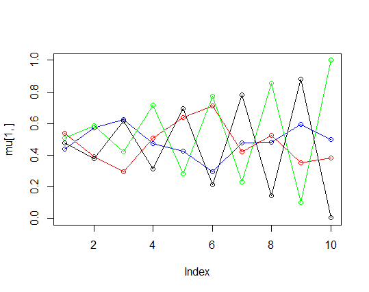

```{r setup, include=FALSE}
knitr::opts_chunk$set(echo = TRUE)
library(mboost)
library(randomForest)
library(ggplot2)
library(partykit)
library(doParallel)
```

#Assignment 1

```{r eval=FALSE,echo=FALSE}
data <- read.csv2(file = "spambase.csv", header = TRUE)
data$Spam <- as.factor(data$Spam)
n=dim(data)[1]
set.seed(12345)
id <- sample(1:n, floor(n/3*2))
train <- data[id,]
test <- data[-id,]
```

##1.1 Adaboost classification trees

```{r eval=FALSE,echo=FALSE}
#adaboost##########################################################
errors1 <- vector()
errors2 <- vector()
for (i in 1:10) {
  mdl_bb <- blackboost(
    formula = Spam~.,
    family = AdaExp(),
    data = train,
    control = boost_control(mstop = i*10)
  )
  p1 <- predict(mdl_bb, test, type = "class")
  p2 <- predict(mdl_bb, train, type = "class")
  e1 <- mean(p1!=test$Spam)
  errors1[i] <- e1
  e2 <- mean(p2!=train$Spam)
  errors2[i] <- e2
}
errors31 <- data.frame(x = rep(1:10,2),
                       v = c(errors1,errors2), 
                       group = c(rep("test",10),rep("train",10)))
ggplot(data = errors31, aes(x=x, 
                           y=v, 
                           color=group))+
  geom_line()+
  geom_point()+
  xlab("number of weak learners")+
  ylab("error rates")
```

The first figure is about the error rates against the number of weak classifiers (trees) for the Adaboost classification trees. Both the test and the training error rates decrease when the number of weak classifiers increases. However, such tendency slows down with the increasement of tree number as well. Additionally, the test error rates are always higher than the training error rates in this case, but they are close to each other.

```{r echo=FALSE}

```

\newpage
##1.2 Random Forests

```{r eval=FALSE,echo=FALSE}
#randomforst#######################################################
errors1 <- vector()
errors2 <- vector()
set.seed(12345)
cl <- parallel::makeCluster(getOption("cl.cores", 4))
registerDoParallel(cl)
for (i in 1:10) {
  mdl_rf <- randomForest(
    formula = Spam~.,
    data = train,
    ntree = i*10,
    parallel = TRUE
  )
  p1 <- predict(mdl_rf, test, type = "class")
  p2 <- predict(mdl_rf, train, type = "class")
  e1 <- mean(p1!=test$Spam)
  errors1[i] <- e1
  e2 <- mean(p2!=train$Spam)
  errors2[i] <- e2
}
errors32 <- data.frame(x = rep(1:10,2),
                      v = c(errors1,errors2), 
                      group = c(rep("test",10),rep("train",10)))
stopCluster(cl)
ggplot(data = errors32, aes(x=x, 
                           y=v, 
                           color=group))+
  geom_line()+
  geom_point()+
  xlab("number of trees")+
  ylab("error rates")

```

Compared with the Adaboost classification trees, the random forest models are better since both test and training error rates (<0.06) of random forest are lower than the ones (>0.07) of Adaboost classification trees. Different from the Adaboost classification trees, there is only a slight decrease for the training error rates when the number of trees grows. For test error rates, it has a decrease tendency but it seems not very obvious. Additionally, the test error rates (red path) are always much higher than the training error rates (blue path) here.

```{r echo=FALSE}

```

\newpage
#Assignment 2

##True Conditional Distributions

The true conditional distributions with seed(1234567890) and weights $\pi=(1/3,1/3,1/3)$ are shown as follow. We assume that there are $L=3$ distributions and all of them are Bernoulli distributed.

```{r include=FALSE,eval=FALSE}
############################ assign2

set.seed(1234567890)
max_it <- 100 # max number of EM iterations
min_change <- 0.1 # min change in log likelihood between two 
                  # consecutive EM iterations
N=1000 # number of training points
D=10 # number of dimensions
x <- matrix(nrow=N, ncol=D) # training data
true_pi <- vector(length = 3) # true mixing coefficients
true_mu <- matrix(nrow=3, ncol=D) # true conditional distributions
true_pi=c(1/3, 1/3, 1/3)
true_mu[1,]=c(0.5,0.6,0.4,0.7,0.3,0.8,0.2,0.9,0.1,1)
true_mu[2,]=c(0.5,0.4,0.6,0.3,0.7,0.2,0.8,0.1,0.9,0)
true_mu[3,]=c(0.5,0.5,0.5,0.5,0.5,0.5,0.5,0.5,0.5,0.5)
plot(true_mu[1,], type="o", col="blue", ylim=c(0,1))
points(true_mu[2,], type="o", col="red")
points(true_mu[3,], type="o", col="green")
# Producing the training data
for(n in 1:N) {
  k <- sample(1:3,1,prob=true_pi)
  for(d in 1:D) {
    x[n,d] <- rbinom(1,1,true_mu[k,d])
  }
}

K=3 # number of guessed components
z <- matrix(nrow=N, ncol=K) # fractional component assignments
pi <- vector(length = K) # mixing coefficients
mu <- matrix(nrow=K, ncol=D) # conditional distributions
llik <- vector(length = max_it) # log likelihood of the EM iterations

# Random initialization of the paramters
pi <- runif(K,0.49,0.51)
pi <- pi / sum(pi)
for(k in 1:K) {
  mu[k,] <- runif(D,0.49,0.51) 
}
pi
mu

################################################################################
for(it in 1:max_it) {
  plot(mu[1,], type="o", col="blue", ylim=c(0,1))
  points(mu[2,], type="o", col="red")
  points(mu[3,], type="o", col="green")
  # points(mu[4,], type="o", col="black")
  # points(mu[5,], type="o", col="orange")
  # Sys.sleep(0.5)
  
  # E-step: Computation of the fractional component assignments
  mux <- matrix(nrow=N, ncol=K)
  for (n in 1:N) {
    for (k in 1:K) {
      mux[n,k] <- prod(mu[k,]^x[n,],(1-mu[k,])^(1-x[n,]))
    }
  }
  z <- t(pi*t(mux))/rowSums(t(pi*t(mux)))
  #Log likelihood computation.
  # E <- sum(log(rowSums(t(pi*t(mux)))))
  E <- 0
  for (n in 1:N) {
    for (k in 1:K) {
      a <- 0
        for (i in 1:D) {
          a <- a+x[n,i]*log(mu[k,i])+(1-x[n,i])*log(1-mu[k,i])
        }
      a <- log(pi[k])+a
      E <- E+z[n,k]*a
    }
  }
  
  llik[it] <- E
  cat("iteration: ", it, "log likelihood: ", llik[it], "\n")
  # flush.console()
  # Stop if the lok likelihood has not changed significantly
  if(it!=1){
    dis <- abs(llik[it]-llik[it-1])
    stopifnot(dis>=min_change)
  }
  #M-step: ML parameter estimation from the data and fractional component 
  # assignments
  pi <- colSums(z)/N
  for (k in 1:K) {
    for (i in 1:D) {
      mu[k,i] <- x[,i]%*%z[,k]/sum(z[,k])
    }
  }
}
pi
mu
plot(llik[1:it], type="o")
```

```{r echo=FALSE}

```

##Estimated Conditional Distributions

Then we create the figure of estimated conditional distributions by EM algorithm with K=3 and min_change=0.1. It iterates 62 times whose log likelihood is -6743.326, and the final weights are $\pi=(0.3259592, 0.3044579, 0.3695828)$.

```{r echo=FALSE, out.height="250px"}

```

It is obvious that all paths of the estimated conditional distributions are quite similar to the original conditional distributions' paths. In estimated plot, the green and blue paths' weights are 0.3259592 and 0.3695828 respectively, which means they affect the mixed distribution more than the red path (0.3044579). Although the red path is not a straight line, it still tends to be straight with iterations. All the output weights close to the original weights as well, which approximates 1/3 respectively.

```{r echo=FALSE, out.height="250px"}

```

After that, the figure above is about the log likelihood values against iterations. It is very clear that the path is monotonically increasing and the log likelihood value changes slightly after 8 iterations. 

Therefore, we create another figure of estimated conditional distributions by EM algorithm with K=2 and min_change=0.1. It only has 16 iterations with log likelihood -6496.662, and the final weights is $\pi=(0.4981919, 0.5018081)$. There are only two paths in the estimated conditional distributions' plot, but they are similar to the first and second roughest paths of the true conditional distributions.

```{r echo=FALSE, out.height="250px"}

```

Although the iterations of EM estimation with K=2 are fewer than the one with K=3, the log likelihood value still increase monotonically and slowly after 8 iterations.

```{r echo=FALSE, out.height="250px"}

```


At last, the remaining two figures show the results of EM estimation with K=4. The iterations are 66 with log likelihood -6874.497. Its weights are $\pi=(0.1614155, 0.1383613, 0.3609912, 0.3392319)$. There are four paths at present, and the first and second roughest paths here approximate the red and blue paths in true conditional distributions as well. Their weights are 0.3609912, 0.3392319 respectively, which are close to 1/3. Besides such two paths, the other two paths seem to be symmetrical around log likelihood equaling 0. It seem that the straight path in the original plot is divided into these two remaining estimated paths (with weights 1/6 respectively).

```{r echo=FALSE, out.height="250px"}

```

The figure with log likelihood values against iterations for K=4 is similar to the others. It also rises monotonically and slowly after 8 iterations, which is same as all other corresponding plots.

```{r echo=FALSE, out.height="250px"}

```

To sum up, the first and second roughest conditional distributions have vital impacts to the mixtures of multivariate Bernoulli distributions. When the number of estimated components is smaller than true number of distributions ($K<L$), EM algorithm will show us the paths of distributions with the largest impacts. When $K=L$, the result is very similar to the true. 

In addition, when $K>L$, the the EM algorithm could also show the distribution paths with large impacts, but the redundant paths would separate the original distributions. To smaller the likelihood value, their paths might be more and more weird and such situation could thereby mislead us. Thus, defining the exact number of components for the EM algorithm is very important.

#Appendix
```{r, ref.label=knitr::all_labels(), echo=TRUE, eval=FALSE}

```