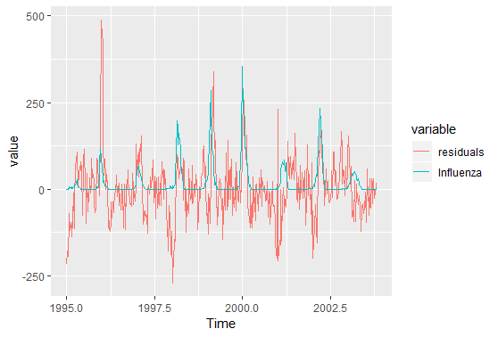

```{r setup, include=FALSE}
knitr::opts_chunk$set(echo = FALSE, warning = FALSE,out.height = "220px")
```

#Assignment 1

##1.1

```{r}

```

It is evident that the influenza and mortality have increasing fluctuations at the same time from 1995 to 2004, although the path of influenza is rougher than the one of mortality. There might be a positive correlation between influenza and mortality.

##1.2

```{r eval=FALSE,echo=TRUE}
library(mgcv)
mdl12 <- gam(Mortality~
               s(Week,k=length(unique(data$Week)))+Year,
             method="GCV.Cp", data=data)
mdl12

# Family: gaussian 
# Link function: identity 
# 
# Formula:
# Mortality ~ s(Week, k = length(unique(data$Week))) + Year
# 
# Estimated degrees of freedom:
# 14.3  total = 16.32 
# 
# GCV score: 8708.581     rank: 52/53
```

Since we assume that mortality is normally distributed and modeled as a linear function of year and spline function of week, we can obtain the underlying probabilistic model as

$$ Mortality \sim N(s(Week)+Year, \sigma^2) $$

##1.3

```{r}
knitr::include_graphics("1.3.png")
```

The blue path represents the predicted mortality and the red path represents the real mortality. Their correlation value are 0.8292424, which means the its fit quality is quite good, and there is a trend in mortality change from one year to another. However, from `summary(mdl12)`, we find week has a larger impact to our FAM model than year. So week appears to be significant in the model.

```{r}

```

For different weeks, the component smooth curves are convergent to the *s* path, which means standard errors are not big and the fitting is okay.

##1.4

```{r}

```

The first figure is from the GAM model with sp=0.0001 and the same other parameters in step 2 and the second is with sp=10000. It is obvious that the predicted mortality in the second figure is worse than the one in the first figure. Their deviances are 3710898 and 9867953 respectively, since higher penalty would make the model more interpretable.

Based on the lecture, When the penalty factor $\lambda$ is larger, the degrees of freedom of $\lambda$ would decrease. The following shows the degrees of freedom from two GAM models before.

```{r eval=FALSE,echo=TRUE}
#              df0.0001       df10000
# (Intercept) 1.0000000  1.000000e+00
# Year        1.0000000  1.000000e+00
# s(Week).1   0.1744199  2.061321e-07
# s(Week).2   0.2180986  1.783846e-07
# s(Week).3   0.2460889  1.531665e-07
# s(Week).4   0.2615994  1.316707e-07
# s(Week).5   0.2597478  1.145954e-07
# s(Week).6   0.2621218  1.025151e-07
# s(Week).7   0.2687787  9.686992e-08
# s(Week).8   0.2810429  1.036357e-07
# s(Week).9   0.2880745  1.466165e-07
# s(Week).10  0.2535648  2.304837e-07
# s(Week).11  0.2279498  2.055913e-07
# s(Week).12  0.2297090  1.644953e-07
# s(Week).13  0.2333461  1.464435e-07
# s(Week).14  0.2375788  1.412173e-07
# s(Week).15  0.2425901  1.433467e-07
# s(Week).16  0.2477030  1.505647e-07
# s(Week).17  0.2522667  1.618065e-07
# s(Week).18  0.2560292  1.764429e-07
# s(Week).19  0.2590606  1.939920e-07
# s(Week).20  0.2615593  2.140077e-07
# s(Week).21  0.2637131  2.360406e-07
# s(Week).22  0.2656455  2.596307e-07
# s(Week).23  0.2674176  2.843141e-07
# s(Week).24  0.2690516  3.096361e-07
# s(Week).25  0.2705524  3.351660e-07
# s(Week).26  0.2719209  3.605123e-07
# s(Week).27  0.2731602  3.853351e-07
# s(Week).28  0.2742771  4.093578e-07
# s(Week).29  0.2752825  4.323751e-07
# s(Week).30  0.2761918  4.542592e-07
# s(Week).31  0.2770235  4.749641e-07
# s(Week).32  0.2777932  4.945299e-07
# s(Week).33  0.2785007  5.130877e-07
# s(Week).34  0.2791105  5.308693e-07
# s(Week).35  0.2795383  5.482254e-07
# s(Week).36  0.2796670  5.656607e-07
# s(Week).37  0.2794260  5.838951e-07
# s(Week).38  0.2789417  6.039630e-07
# s(Week).39  0.2787408  6.273354e-07
# s(Week).40  0.2800138  6.558593e-07
# s(Week).41  0.2848786  6.900389e-07
# s(Week).42  0.2952704  7.149846e-07
# s(Week).43  0.2757575  5.645441e-07
# s(Week).44  0.2741549 -3.493642e-08
# s(Week).45  0.2744223 -2.039836e-07
# s(Week).46  0.2691830 -5.243968e-08
# s(Week).47  0.2558401  5.685598e-08
# s(Week).48  0.2250866  1.256011e-07
# s(Week).49  0.1624180  1.742382e-07
# s(Week).50  0.9935452  5.878846e-05
# s(Week).51  0.9999999  1.000000e+00
```

Thus, the output confirms the relationship between the $\lambda$ and the degrees of freedom.

##1.5

```{r}

```

Obviously, there is a dramatic variation of mortality residuals while there is outbreak of influenza, although the path of residuals is much rougher than the one of influenza. The reason might be that the larger residuals always occur with the outbreaks of mortality, which is positively correlated with the path of influenza.

##1.6

```{r}

```

The predicted path of mortality is better than the one in step 3. Its correlation value with original mortality is 0.9244462, and the its deviance is 1731415, which is smaller than 3718012, the deviance of model in step 2. Thus, it seems that week is a better measurement for the change of mortality.

```{r eval=FALSE,echo=FALSE}

#1.1###########################################################################
set.seed(12345)
data <- readxl::read_xlsx("influenza.xlsx")
dt1 <- reshape2::melt(data[,3:5], id="Time")
library(ggplot2)
ggplot(data=dt1,aes(x=Time,y=value, color=variable))+
  geom_line()+
  labs(title="Influenza and Mortality")
# It seems the mortality have a positively correlation with influenza.

#1.2###########################################################################
library(mgcv)
mdl12 <- gam(Mortality~
               s(Week,k=length(unique(data$Week)))+Year,
             method="GCV.Cp", data=data)
mdl12$sp
#1.3###########################################################################
p_Mortality <- fitted(mdl12)
dt3 <- reshape2::melt(cbind(data[,3:4],p_Mortality), id="Time")
ggplot(data=dt3,aes(x=Time,y=value, color=variable))+
  geom_line()+
  labs(title="Real and predicted Mortality")

cor(x=p_Mortality,y=data[,4])

plot(mdl12,main = "spline component") #  spline component
plot(mdl12,residuals = TRUE)    # smoothing residuals   

#1.4###########################################################################
summary(mdl12)
mdl141 <- gam(Mortality~Year+
               s(Week,k=length(unique(data$Week)),sp=0.0001),
             method="GCV.Cp", data=data)
p_Mortality <- fitted(mdl141)
dt3 <- reshape2::melt(cbind(data[,3:4],p_Mortality), id="Time")
p141 <- ggplot(data=dt3,aes(x=Time,y=value, color=variable))+
  geom_line()+
  labs(title="sp=0.0001")

mdl142 <- gam(Mortality~Year+
               s(Week,k=length(unique(data$Week)),sp=10000),
             method="GCV.Cp", data=data)
p_Mortality <- fitted(mdl142)
dt3 <- reshape2::melt(cbind(data[,3:4],p_Mortality), id="Time")
p142 <- ggplot(data=dt3,aes(x=Time,y=value, color=variable))+
  geom_line()+
  labs(title="sp=10000")

plot(gridExtra::arrangeGrob(p141,p142))

mdl141$deviance
mdl142$deviance
data.frame(df0.0001=mdl141$edf,df10000=mdl142$edf)
# see page 16 in lecture 2b2
# when the penality is larger, the degrees of freedom are smaller

#1.5###########################################################################
dt5 <- data.frame(Time=data$Time,residuals=mdl12$residuals,
                  Influenza=data$Influenza)
dt5 <- reshape2::melt(dt5, id="Time")
ggplot(data=dt5,aes(x=Time,y=value, color=variable))+
  geom_line()

#1.6###########################################################################
mdl16 <- gam(Mortality~s(Influenza,k=length(unique(data$Influenza)))+
               s(Week,k=length(unique(data$Week)))+
               s(Year,k=length(unique(data$Year))),
             method="GCV.Cp", data=data)
p_Mortality <- fitted(mdl16)
dt6 <- reshape2::melt(cbind(data[,3:4],p_Mortality), id="Time")
ggplot(data=dt6,aes(x=Time,y=value, color=variable))+
  geom_line()+
  labs(title="Mortality~s(Influenza)+s(Week)+s(Year)")

# yes
cor(x=p_Mortality,y=data[,4])
mdl16$deviance
mdl12$deviance

plot(mdl141)

```


\newpage
#Assignment 2 High-dimensional methods

##1
```{r,echo=F}
#assign2######################################################################
#read data
Sys.setlocale(locale = "English")
df<-read.csv2("data.csv",sep=";")
#make Conference a factor 
df$Conference<-as.factor(df$Conference)
set.seed(12345)
#split data to train and test
ind<-sample(nrow(df),floor(0.7*nrow(df)))
dftrain<-df[ind,]
dftest<-df[-ind,]

```


```{r,echo=F,message=F}

library(pamr)
#get the features
x<-t(dftrain[,-which(names(dftrain) == "Conference")])
#get the class
y<-as.factor(dftrain$Conference)
#make a list of data for centroid model
list_df=list(x=x,y=y,
             geneid=as.character(1:nrow(x)), genenames=rownames(x))
#fit model
par.model=pamr.train(list_df)
#cross validation
cvmodel=pamr.cv(par.model,list_df)
#find threshold
thres=cvmodel$threshold[which(cvmodel$error==min(cvmodel$error))]

```


```{r,echo=F}
#plot centroids
pamr.plotcen(par.model, list_df, threshold=thres)

```

The centroid plot is describing the distance of each feature from the 2 classes (0 and 1).The red column is coresponding to class 0 and green ceresponds to class 1


```{r,echo=F,message=FALSE,echo=F,results="hide"}
#make a matrix with the cetroids
mat_genes<-invisible(pamr.listgenes(par.model,list_df,threshold=thres,genenames=T))
#number of parameters selected
num_centr<-nrow(mat_genes)
cat("The number of parametrs selected are: ",num_centr) 
```


```{r,echo=F}
#10 most contributing features
cat("The 10 most contributing features are :\n",
    mat_genes[1:10,2])

```

It its reasonable that the most cotributing features reported have a strong effect on classifing a mail as "announces of conferences" or not.Usually conference mails contain one or more of the words reported as most contributing.


```{r,echo=F}
#get the test features ->transpose it 
dftest_features<-t(dftest[,-which(names(dftest) == "Conference")])
#make predictions
pred_pamr<-pamr.predict(par.model,dftest_features, threshold=thres,type="class")
#misclassificaiton error centroid
mis_error_cen<-mean(pred_pamr!=dftest$Conference)
#accuracy centroid
accuracy_cen<-mean(pred_pamr==dftest$Conference)
cat("==============================================================================================\n",
    "The misclssification error for test data is : ",mis_error_cen,
    "and the accuracy for test data is : ",accuracy_cen)

```

\newpage
##2a

```{r,echo=F,message=FALSE}
set.seed(12345)
library(glmnet)
#library(parallel)

#make feature matrix
X_data=dftrain[,-which(names(dftrain) == "Conference")]
y_data=as.factor(dftrain$Conference)

#fit elastic model
elastic.fit<-cv.glmnet(as.matrix(X_data),y_data,family="binomial",alpha=0.5)


#test data
fitted_test<-as.matrix(dftest[,-which(names(dftest)=="Conference")])
#make predictions using lambda.min
elastic_preds<-predict(elastic.fit,fitted_test,type="class",s="lambda.1se")

#misclassification error elastic
mis_error_el<-mean(elastic_preds!=dftest$Conference)
#acuracy elastic 
accuracy_el<-mean(elastic_preds==dftest$Conference)
cat("==============================================================================================\n",
    "The misclssification error for test data is : ",mis_error_el,
    "and the accuracy for test data is : ",accuracy_el)


```

```{r,echo=F}
#length of coefficients
num_elastic<-length(coef(elastic.fit,s=elastic.fit$lambda.1se)@x)
cat("The number of coefficients for elastic is: ",num_elastic)

```


##2b
```{r,echo=F,message=FALSE}
library(kernlab)
#fit svm model with vanilladot kernel
svm<-ksvm(as.matrix(X_data),y_data,kernel="vanilladot") #getting a warring
#make predictions
svm_preds<-predict(svm,fitted_test,type="response")

mis_error_svm<-mean(svm_preds!=dftest$Conference)
accuracy_svm<-mean(svm_preds==dftest$Conference)
cat("\n")
cat("==============================================================================================\n",
    "The misclssification error for test data is : ",mis_error_svm,
    "and the accuracy for test data is : ",accuracy_svm)
```

```{r,echo=F}
num_svm<-length(coef(svm)[[1]])
cat("The number of coefficients for svm is: ",num_svm )

```


```{r,echo=F}
library(xtable)
#
sum_data<-data.frame(c(mis_error_cen,mis_error_el,mis_error_svm),
                     c(accuracy_cen,accuracy_el,accuracy_svm),
                     c(num_centr,num_elastic,num_svm),
                     c("centroid","elastic","svm"))
colnames(sum_data)<-c("misclass.error","accuracy","n_features","model")


library(knitr)
#make a table 
kable(sum_data, caption = "Summary table")

```

The table provides misclassification error,accuracy and number of features selected for the 3 models we train.According to the table the svm looks more preferable from the rest of the models, it has a very low misclassification error(high accuracy) and with fewer features compared to other models.


##3
```{r,echo=F}

t<-sapply(df[,-which(names(df)=="Conference")],
          function(x){ t.test(x[df$Conference==1],x[df$Conference==0])[["p.value"]]})

benj<-function(p_values,alpha=0.05){
  p_values<-sort(p_values)
  indexes<-c(1:length(p_values))
  L<-p_values-((alpha*indexes)/length(p_values))
  best_p<-max(L[which(L<0)])
  cutoff<-p_values[L==best_p]
  rejected_values<-p_values[p_values<=cutoff]
  list(cutoff,rejected_values)
  
               
}

rej<-as.data.frame(benj(t)[[2]])
colnames(rej)<-c("p-value")
cat("========================================================\n",
    "The cutoff value is: ",benj(t)[[1]])
cat("\n")
cat("=========================================================\n",
    "The features coresponding to reject hypotheses are : \n")

kable(rej, caption = "Benjamin test")
```

From the table we can see the features that rejected from null hypotheses are the ones that are significant because the class of 1 which is the "announces of conferences" is more likely for these features.This seems reasonable because the words in the above talbe are more likely to be included in an email that 
is related to conference anouncement. They also contain all the features (words) of the 10 contributing words in step 1.


\newpage
# Contributions
Assignment 1 is from *Zijie Feng* and assignment 2 is from *Andreas Christopoulos Charitos*.

#Appendix


```{r, ref.label=knitr::all_labels(), echo=TRUE, eval=FALSE}

```
