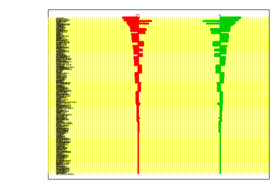

```{r setup, include=FALSE}
knitr::opts_chunk$set(echo = FALSE, warning = FALSE,out.height = "220px")
```

#Assignment 1

##1.1

```{r}
knitr::include_graphics("1.1.png")
```

It is evident that the influenza and mortality have increasing fluctuations at the same time from 1995 to 2004, although the path of influenza is rougher than the one of mortality. There might be a positive correlation between influenza and mortality.

##1.2

```{r eval=FALSE,echo=TRUE}
library(mgcv)
mdl12 <- gam(Mortality~
               s(Week,k=length(unique(data$Week)))+Year,
             method="GCV.Cp", data=data)
mdl12

# Family: gaussian 
# Link function: identity 
# 
# Formula:
# Mortality ~ s(Week, k = length(unique(data$Week))) + Year
# 
# Estimated degrees of freedom:
# 14.3  total = 16.32 
# 
# GCV score: 8708.581     rank: 52/53
```

Since we assume that mortality is normally distributed and modeled as a linear function of year and spline function of week, we can obtain the underlying probabilistic model as

$$ Mortality \sim N(s(Week)+Year, \sigma^2) $$

##1.3

```{r}
knitr::include_graphics("1.3.png")
```

The blue path represents the predicted mortality and the red path represents the real mortality. Their correlation value are 0.8292424, which means the its fit quality is quite good, and there is a trend in mortality change from one year to another. However, from `summary(mdl12)`, we find week has a larger impact to our FAM model than year. So week appears to be significant in the model.

```{r}
knitr::include_graphics("1.3.2.png")
```

For different weeks, the component smooth curves are convergent to the *s* path, which means standard errors are not big and the fitting is okay.

##1.4

```{r}
knitr::include_graphics("1.4.png")
```

The first figure is from the GAM model with sp=0.0001 and the same other parameters in step 2 and the second is with sp=10000. It is obvious that the predicted mortality in the second figure is worse than the one in the first figure. Their deviances are 3710898 and 9867953 respectively, since higher penalty would make the model more interpretable.

Based on the lecture, When the penalty factor $\lambda$ is larger, the degrees of freedom of $\lambda$ would decrease. The following shows the degrees of freedom from two GAM models before.

```{r eval=FALSE,echo=TRUE}
#              df0.0001       df10000
# (Intercept) 1.0000000  1.000000e+00
# Year        1.0000000  1.000000e+00
# s(Week).1   0.1744199  2.061321e-07
# s(Week).2   0.2180986  1.783846e-07
# s(Week).3   0.2460889  1.531665e-07
# s(Week).4   0.2615994  1.316707e-07
# s(Week).5   0.2597478  1.145954e-07
# s(Week).6   0.2621218  1.025151e-07
# s(Week).7   0.2687787  9.686992e-08
# s(Week).8   0.2810429  1.036357e-07
# s(Week).9   0.2880745  1.466165e-07
# s(Week).10  0.2535648  2.304837e-07
# s(Week).11  0.2279498  2.055913e-07
# s(Week).12  0.2297090  1.644953e-07
# s(Week).13  0.2333461  1.464435e-07
# s(Week).14  0.2375788  1.412173e-07
# s(Week).15  0.2425901  1.433467e-07
# s(Week).16  0.2477030  1.505647e-07
# s(Week).17  0.2522667  1.618065e-07
# s(Week).18  0.2560292  1.764429e-07
# s(Week).19  0.2590606  1.939920e-07
# s(Week).20  0.2615593  2.140077e-07
# s(Week).21  0.2637131  2.360406e-07
# s(Week).22  0.2656455  2.596307e-07
# s(Week).23  0.2674176  2.843141e-07
# s(Week).24  0.2690516  3.096361e-07
# s(Week).25  0.2705524  3.351660e-07
# s(Week).26  0.2719209  3.605123e-07
# s(Week).27  0.2731602  3.853351e-07
# s(Week).28  0.2742771  4.093578e-07
# s(Week).29  0.2752825  4.323751e-07
# s(Week).30  0.2761918  4.542592e-07
# s(Week).31  0.2770235  4.749641e-07
# s(Week).32  0.2777932  4.945299e-07
# s(Week).33  0.2785007  5.130877e-07
# s(Week).34  0.2791105  5.308693e-07
# s(Week).35  0.2795383  5.482254e-07
# s(Week).36  0.2796670  5.656607e-07
# s(Week).37  0.2794260  5.838951e-07
# s(Week).38  0.2789417  6.039630e-07
# s(Week).39  0.2787408  6.273354e-07
# s(Week).40  0.2800138  6.558593e-07
# s(Week).41  0.2848786  6.900389e-07
# s(Week).42  0.2952704  7.149846e-07
# s(Week).43  0.2757575  5.645441e-07
# s(Week).44  0.2741549 -3.493642e-08
# s(Week).45  0.2744223 -2.039836e-07
# s(Week).46  0.2691830 -5.243968e-08
# s(Week).47  0.2558401  5.685598e-08
# s(Week).48  0.2250866  1.256011e-07
# s(Week).49  0.1624180  1.742382e-07
# s(Week).50  0.9935452  5.878846e-05
# s(Week).51  0.9999999  1.000000e+00
```

Thus, the output confirms the relationship between the $\lambda$ and the degrees of freedom.

##1.5

```{r}
knitr::include_graphics("1.5.png")
```

Obviously, there is a dramatic variation of mortality residuals while there is outbreak of influenza, although the path of residuals is much rougher than the one of influenza. The reason might be that the larger residuals always occur with the outbreaks of mortality, which is positively correlated with the path of influenza.

##1.6

```{r}
knitr::include_graphics("1.6.png")
```

The predicted path of mortality is better than the one in step 3. Its correlation value with original mortality is 0.9244462, and the its deviance is 1731415, which is smaller than 3718012, the deviance of model in step 2. Thus, it seems that week is a better measurement for the change of mortality.

\newpage
#Assignment 2

##2.1

```{r}

```

The centroid plot shows how much the different features affect the final labels. There are totally 231 features in NSC model. The threshold chosen by cross-validation is 1.305933 (th). The first 10 contributing feature are as follow:

```{r eval=FALSE, echo=TRUE}
vib1[1:10,]
#       id     name         0-score   1-score  
#  [1,] "3036" "papers"     "-0.3814" "0.5019" 
#  [2,] "2049" "important"  "-0.3519" "0.4631" 
#  [3,] "4060" "submission" "-0.3368" "0.4431" 
#  [4,] "1262" "due"        "-0.3301" "0.4344" 
#  [5,] "3364" "published"  "-0.3223" "0.4241" 
#  [6,] "3187" "position"   "0.318"   "-0.4184"
#  [7,] "596"  "call"       "-0.2717" "0.3575" 
#  [8,] "869"  "conference" "-0.2698" "0.355"  
#  [9,] "1045" "dates"      "-0.2698" "0.355"  
# [10,] "607"  "candidates" "0.2468"  "-0.3247"
```

Using the test set, the misclassification error rate is 0.1 for the of NSC model with CV-chosen threshold. It is reasonable since "papers", "important", "submission", "due" and the other words are high-frequent words in the conferences.

\newpage
##2.2

| Algorithms  | Num.variables |Train error rate| Test error rate  |
|--:|:--|:--|:--|
| NSC |  231 |0.09| 0.1  |
| Elastic net  |  12 |0.11| 0.15  |
|  SVM |  43 | 0.02| 0.05 |

It seems that SVM with “vanilladot” kernel is the best model since it not only has relatively small number of remaining variables but also lowest train and test missclassification error rates.

##2.3

```{r echo=TRUE,eval=FALSE}
#2.3###########################################################################
x <- data[,colnames(train)!="Conference"]
y <- data[,colnames(train)=="Conference"]
j=1:ncol(x)
pvalues <- sapply(j,FUN=function(i){
  pvalue <- t.test(x[,i]~Conference,data = data, 
                   alternative = "two.sided")$p.value
  pvalue
})
idx <- order(pvalues)
pvalues <- as.data.frame(pvalues[idx])
pvalues$index <- idx

a <- 0.05
pvalues$required <- pvalues[,1]< a*as.numeric(rownames(pvalues))/ncol(x)
L <- max(rownames(pvalues[pvalues$required==TRUE,])) # 9
rej <- pvalues[1:L,]$index
rej_f <- colnames(x)[rej]   
rej_f

# [1] "papers"     "submission" "position"   "published"  "important" 
# [6] "call"       "conference" "candidates" "dates"  
```

There are 9 variables rejected by Benjamini-Hochberg method with false discovery rate $\alpha=0.05$, such as "papers", "submission", "position"," published", "important", "call", "conference", "candidates" and "dates". The result is the same as the the 10 most contributing features in step 1, except for "due", which confirm that these 9 words are vitual for indentiy of "announces of conferences".

\newpage
#Appendix

```{r echo=TRUE,eval=FALSE}

#1.1###########################################################################
set.seed(12345)
data <- readxl::read_xlsx("influenza.xlsx")
dt1 <- reshape2::melt(data[,3:5], id="Time")
library(ggplot2)
ggplot(data=dt1,aes(x=Time,y=value, color=variable))+
  geom_line()+
  labs(title="Influenza and Mortality")
# It seems the mortality have a positively correlation with influenza.

#1.2###########################################################################
library(mgcv)
mdl12 <- gam(Mortality~
               s(Week,k=length(unique(data$Week)))+Year,
             method="GCV.Cp", data=data)
mdl12$sp
#1.3###########################################################################
p_Mortality <- fitted(mdl12)
dt3 <- reshape2::melt(cbind(data[,3:4],p_Mortality), id="Time")
ggplot(data=dt3,aes(x=Time,y=value, color=variable))+
  geom_line()+
  labs(title="Real and predicted Mortality")

cor(x=p_Mortality,y=data[,4])

plot(mdl12,main = "spline component") #  spline component
plot(mdl12,residuals = TRUE)    # smoothing residuals   

#1.4###########################################################################
summary(mdl12)
mdl141 <- gam(Mortality~Year+
               s(Week,k=length(unique(data$Week)),sp=0.0001),
             method="GCV.Cp", data=data)
p_Mortality <- fitted(mdl141)
dt3 <- reshape2::melt(cbind(data[,3:4],p_Mortality), id="Time")
p141 <- ggplot(data=dt3,aes(x=Time,y=value, color=variable))+
  geom_line()+
  labs(title="sp=0.0001")

mdl142 <- gam(Mortality~Year+
               s(Week,k=length(unique(data$Week)),sp=10000),
             method="GCV.Cp", data=data)
p_Mortality <- fitted(mdl142)
dt3 <- reshape2::melt(cbind(data[,3:4],p_Mortality), id="Time")
p142 <- ggplot(data=dt3,aes(x=Time,y=value, color=variable))+
  geom_line()+
  labs(title="sp=10000")

plot(gridExtra::arrangeGrob(p141,p142))

mdl141$deviance
mdl142$deviance
data.frame(df0.0001=mdl141$edf,df10000=mdl142$edf)
# see page 16 in lecture 2b2
# when the penality is larger, the degrees of freedom are smaller

#1.5###########################################################################
dt5 <- data.frame(Time=data$Time,residuals=mdl12$residuals,
                  Influenza=data$Influenza)
dt5 <- reshape2::melt(dt5, id="Time")
ggplot(data=dt5,aes(x=Time,y=value, color=variable))+
  geom_line()

#1.6###########################################################################
mdl16 <- gam(Mortality~s(Influenza,k=length(unique(data$Influenza)))+
               s(Week,k=length(unique(data$Week)))+
               s(Year,k=length(unique(data$Year))),
             method="GCV.Cp", data=data)
p_Mortality <- fitted(mdl16)
dt6 <- reshape2::melt(cbind(data[,3:4],p_Mortality), id="Time")
ggplot(data=dt6,aes(x=Time,y=value, color=variable))+
  geom_line()+
  labs(title="Mortality~s(Influenza)+s(Week)+s(Year)")

# yes
cor(x=p_Mortality,y=data[,4])
mdl16$deviance
mdl12$deviance

plot(mdl141)


#2.1###########################################################################
# Sys.setlocale(locale = "English")
set.seed(12345)
data <- read.csv("data.csv",sep = ";")
idx <- sample(nrow(data),floor(nrow(data)*0.7))
train <- data[idx,]
test <- data[-idx,]

library(pamr)
rownames(data)=1:nrow(data)
xtrain=t(train[,colnames(train)!="Conference"])
ytrain=train[,"Conference"]
mydata=list(x=xtrain,y=as.factor(ytrain),
            geneid=as.character(1:nrow(xtrain)), 
            genenames=rownames(xtrain))

model=pamr.train(mydata)
cvmodel <- pamr.cv(model, mydata)

df <- as.matrix(data.frame(error=cvmodel$error,th=cvmodel$threshold))

df <- df[order(df[,1]),]
pamr.plotcen(model, mydata, threshold=df[1,2])
vib1<- pamr.listgenes(model,mydata,threshold = df[1,2],genenames = TRUE)[,2]
# 231
# vib1[1:10,]

xtest=t(test[,colnames(test)!="Conference"])
ypred <- pamr.predict(model,xtest,threshold = df[1,2],type = "class")
ytest=as.factor(test[,"Conference"])
mean(ytest!=ypred) #0.1

ypred <- pamr.predict(model,xtrain,threshold = df[1,2],type = "class")
mean(ytrain!=ypred) #0.09

#2.2###########################################################################
library(glmnet)
set.seed(12345)
mdl221 <- cv.glmnet(t(xtrain),as.factor(ytrain),family="binomial",alpha=0.5)
p221 <- predict(mdl221,t(xtest),type="class",s="lambda.1se")
mean(p221!=ytest)   # 0.15
p221 <- predict(mdl221,t(xtrain),type="class",s="lambda.1se")
mean(p221!=ytrain)   # 0.1136364
coef <- as.matrix(coef(mdl221,s=mdl221$lambda.1se))
vib2 <- names(coef[coef[,1]!=0,])
# vib2 <- vib2[-1]
length(vib2)  # 12

library(kernlab)
mdl222 <- ksvm(x=t(xtrain),y=as.factor(ytrain),kernel="vanilladot")
p222 <- predict(mdl222,t(xtest))
mean(p222!=ytest)  # 0.05
p222 <- predict(mdl222,t(xtrain))
mean(p222!=ytrain)  # 0.05
vib3 <- coef(mdl222)[[1]]
length(vib3) # 43

#2.3###########################################################################
x <- data[,colnames(train)!="Conference"]
y <- data[,colnames(train)=="Conference"]
j=1:ncol(x)
pvalues <- sapply(j,FUN=function(i){
  pvalue <- t.test(x[,i]~Conference,data = data, 
                   alternative = "two.sided")$p.value
  pvalue
})
idx <- order(pvalues)
pvalues <- as.data.frame(pvalues[idx])
pvalues$index <- idx

a <- 0.05
pvalues$required <- pvalues[,1]< a*as.numeric(rownames(pvalues))/ncol(x)
L <- max(rownames(pvalues[pvalues$required==TRUE,]))
rej <- pvalues[1:L,]$index
rej_f <- colnames(x)[rej]


```

