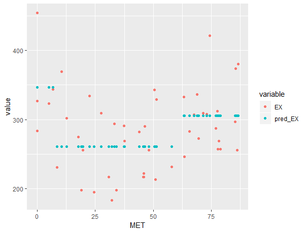

```{r setup, include=FALSE}
knitr::opts_chunk$set(echo = TRUE)
```

#Assignment2

##2.1

```{r echo=FALSE, eval=FALSE}
#2.1#####################################################
library(readxl)
data <- read_xls("creditscoring.xls")
data$good_bad <- as.factor(data$good_bad)
n=dim(data)[1]
set.seed(12345)
id=sample(1:n, floor(n*0.5))
train=data[id,]
id1=setdiff(1:n, id)
set.seed(12345)
id2=sample(id1, floor(n*0.25))
valid=data[id2,]
id3=setdiff(id1,id2)
test=data[id3,]
```

We divide the original data into 3 parts: training, validation and test sets using data partitioning code specified in Lecture 1e.

##2.2

```{r echo=FALSE, eval=FALSE}
#2.2#####################################################
library(tree)
library(rpart)
t21=tree(good_bad~., data=train,
         split = c("deviance"))
# plot(t21)
# text(t21, pretty=0)
p211 <- predict(t21, train, type = "class")
p212 <- predict(t21, test, type = "class")
e211 <- mean(p211!=train$good_bad)
e211  # 0.212
e212 <- mean(p212!=test$good_bad)
e212  # 0.268

t22=tree(good_bad~., data=train,
         split = "gini")
# plot(t22)
# text(t22, pretty=0)
p221 <- predict(t22, train, type = "class")
p222 <- predict(t22, test, type = "class")
e221 <- mean(p221!=train$good_bad)
e221  # 0.238
e222 <- mean(p222!=test$good_bad)
e222  # 0.372

# since both training and test misclassification rates are smaller 
t2 <- t21
```

We fit two decision trees measured by deviance and gini index respectively. In the "deviance" tree, the misclassification rates for training and test rates are 0.212 and 0.268 respectively. In the "gini" tree, the misclassification rates are 0.238 and 0.372 respectively. Since the error rates of the "deviance" tree has smaller error rates, we select it for the following steps.

##2.3

```{r echo=FALSE,eval=FALSE}
#2.3########################################################
dt3 <- as.data.frame(matrix(nrow = 14,ncol = 3))
for (i in 2:15) {
  ptree <- prune.tree(t2,best=i)
  p31 <- predict(ptree,type="tree")
  p32 <- predict(ptree,newdata=valid,type="tree")
  dt3[i-1,] <- c(i, deviance(p31),deviance(p32))
}
# dt3
names(dt3) <- c("number of leaves","training","validation")
library(reshape2)
dt3 <- melt(as.data.frame(dt3), id="number of leaves")
library(ggplot2)
ggplot(data=as.data.frame(dt3),
       aes(x=`number of leaves`,y=value,color=variable))+
  geom_line()+
  geom_point()+
  xlab("number of leaves")+
  ylab("deviance")
# when the number of leaves is 4, the validation deviance is the smallest
t3 <- prune.tree(t2,best=4)
plot(t3)
text(t3, pretty=0)
nodes <- as.numeric(rownames(t3$frame))
max(rpart:::tree.depth(nodes))  
# depth 3, variables history duration savings
p31 <- predict(t3, train, type = "class")
p32 <- predict(t3, test, type = "class")
mean(p31!=train$good_bad)          # 0.252
mean(p32!=test$good_bad)           # 0.256
```

```{r  echo=FALSE,out.height="200px"}
knitr::include_graphics("2.3.png")
```

Present the graphs of the dependence of deviances for the training and the validation data on the number of leaves for training and validation sets. When the number of leaves is 4, the deviance of our tree is the smallest. We create the regression tree with 4 terminal nodes.

```{r  echo=FALSE, out.height="200px"}
knitr::include_graphics("2.32.png")
```

The variables such tree selects are savings (<2.5), duration(<43.5) and history(<1.5). The tree depth is 3 and the misclassification rates for the training and test sets are 0.252 and 0.256 respectively.

##2.4

```{r echo=FALSE,eval=FALSE}
#2.4########################################################
library(MASS)
library(e1071)
b=naiveBayes(good_bad~., data=train)
p41=predict(b, newdata=train)
p42=predict(b, newdata=test)
mat_train <- table(train$good_bad,p41,dnn = c("Labels","prediction"))
#       prediction
# Labels bad good
#   bad   95   52
#   good  98  255
mat_test <- table(test$good_bad,p42,dnn = c("Labels","prediction"))
#       prediction
# Labels bad good
#   bad   46   30
#   good  49  125
1-(sum(diag(mat_train))/dim(train)[1]) #0.3
1-(sum(diag(mat_test))/dim(test)[1])   #0.316
# pruned tree is better than Naive Bayes
```

The error rate and confusion matrix for the training data are 0.3 and

|    |     |prediction| |
|---:|:----|:-----|:-----|
|   |   |bad   |good |
|  labels |bad    |95   |52      |
|   |good    |98   |255    |

The error rate and confusion matrix for the test data are 0.316 and

|    |     |prediction| |
|---:|:----|:-----|:-----|
|   |   |bad   |good |
| labels  |bad    |46   |30      |
|   |good    |49   |125    |

Compared with the misclassification rates from the optimal tree in step 3, the rates of naive Bayes model are higher. Thus, we conclude that our optimal tree in step 3 is better.

##2.5

```{r echo=FALSE,eval=FALSE}
#2.5########################################################
dt5 <- as.data.frame(matrix(nrow = 19,ncol = 5))
dt5[,1] <- seq(.05,0.95,0.05)
for (i in 1:19) {
  p51 <- predict(t3, test, type="vector")
  p52 <- predict(b, test, type="raw")
  pp51 <- factor(p51[,2]>dt5[i,1],labels = c("bad","good"),levels = c("FALSE","TRUE"))
  pp52 <- factor(p52[,2]>dt5[i,1],labels = c("bad","good"),levels = c("FALSE","TRUE"))
  mat_51 <- table(test$good_bad,pp51,dnn = c("Labels","prediction"))
  mat_52 <- table(test$good_bad,pp52,dnn = c("Labels","prediction"))
  temp <-c(mat_51[2,2]/sum(mat_51[2,]), mat_51[1,2]/sum(mat_51[1,]), 
           mat_52[2,2]/sum(mat_52[2,]), mat_52[1,2]/sum(mat_52[1,]))
  dt5[i,2:5] <- temp
}
names(dt5) <- c("pi","TPR", "FPR","TPR", "FPR")
dt55 <- rbind(dt5[,2:3],dt5[,4:5])
dt55$group <- c(rep("optimal tree",19),rep("naive bayes",19))
library(ggplot2)
ggplot(dt55, aes(x=FPR,y=TPR,color=group))+
  geom_line()+
  labs(title="ROC curves")
```

```{r  echo=FALSE, out.height="200px"}

```

Depending on the requirement, we draw the ROC curves of both the optimal tree from step 3 and the naive Bayes model from step 4. It is clear that the red path (naive Bayes) cover more area on the figure. The TPR of naive Bayes is close to 1 and FPR close to 0. Thus, although the error rates of the naive Bayes model is a litter bit higher than optimal tree model, it preforms better in the ROC curve analysis.

##2.6

```{r echo=FALSE,eval=FALSE}
#2.6########################################################
b=naiveBayes(good_bad~., data=train)
p41=predict(b, newdata=train,type = "raw")
p41 <- ifelse(p41[,1]*10>p41[,2],"bad","good")
mat_train <- table(train$good_bad,p41,dnn = c("Labels","prediction"))
#       prediction
# Labels bad good
#   bad  137   10
#   good 263   90
1-(sum(diag(mat_train))/dim(train)[1]) #0.546

p42=predict(b, newdata=test,type = "raw")
p42 <- ifelse(p42[,1]*10>p42[,2],"bad","good")
mat_test <- table(test$good_bad,p42,dnn = c("Labels","prediction"))
#       prediction
# Labels bad good
#   bad   71    5
#   good 122   52
1-(sum(diag(mat_test))/dim(test)[1])   #0.508
```

The error rate and confusion matrix for the training data are 0.546 and

|    |     |prediction| |
|---:|:----|:-----|:-----|
|  |   |bad   |good |
|  labels  |bad    |137   |10      |
|   |good   |263   |90    |

The error rate and confusion matrix for the test data are 0.508 and

|    |     |prediction| |
|---:|:----|:-----|:-----|
|  |   |bad   |good |
|  labels  |bad    |71   |5      |
|   |good    |122   |52    |

Because of the loss matrix, it punishes a lot that we predict a person who managed their loans badly as a person who do well. Therefore, compared with the model in step 4, the misclassification rates here are much higher, both of the training and test sets become 0.546 and 0.508 respectively.

\newpage
#Assignment 3

##3.1

```{r echo=FALSE,eval=FALSE}
#3.1#####################################################
data <- read.csv2("State.csv")
data <- data[order(data[,"MET"]),]
mdl <- lm(EX ~ poly(MET, degree=3), data = data)
pp <- as.data.frame(predict(mdl,data))
library(ggplot2)
ggplot(data = data,aes(x=MET,y=EX))+
  geom_point()+
  # stat_smooth()+
  geom_line(data=pp,aes(x=data$MET,y=pp[,1]))

# polynomial

#3.2#####################################################
library(tree)
dt2 <- data[,c("MET","EX")]
t2 <- tree(formula = EX~MET, data = dt2,
           control = tree.control(nobs =  nrow(data), minsize = 8))
set.seed(12345)
cv.res=cv.tree(t2)
plot(cv.res$size, cv.res$dev, type="b",
     col="red")  # size = 3 (number of terminal nodes)

ptree <- prune.tree(t2,best=3)
melt_point <- dt2
melt_point$pred_EX <- predict(ptree)
library(reshape2)
melt_point <- melt(melt_point, id="MET")
ggplot(data = melt_point, aes(x=MET,y=value,color=variable))+
  geom_point()


re22 <- data.frame(residuals=residuals(ptree))
ggplot(re22,aes(x=residuals))+
  geom_histogram(aes(y=..density..),
                 colour="black",
                 fill="white",
                 bins=30)+
  geom_density(alpha=.2, fill="#FF6666")

# the residuals seem not to be a normal distribution, which means
# that the tree is not good enough

# overfitting

#3.3############################################################################
library(boot)
fun <- function(dt, ind){
  t1 <- tree(formula = EX~MET, data = dt[ind,],
             control = tree.control(nobs =  nrow(dt), minsize = 8))
  ptree <- prune.tree(t1,best=3)
  return(predict(ptree, newdata = dt2))
}
set.seed(12345)
b3 <- boot(dt2,fun, R=1000) 
envel <- envelope(b3)
dt3 <- as.data.frame(t(envel$point))
library(ggplot2)
ggplot()+
  geom_point(data = melt_point, aes(x=MET,y=value,color=variable))+
  geom_line(data=dt3,aes(x=data$MET,y=V1))+
  geom_line(data=dt3,aes(x=data$MET,y=V2))
# bumpy, not smooth

#3.4############################################################################
rng <- function(data, mle) {
  data1=data
  n=nrow(data)
  data1$EX=rnorm(n,predict(mle, newdata=data1),sd(residuals(mle)))
  return(data1)  # add noise to the data
}
set.seed(12345)
b4 <- boot(dt2, fun, R=1000, mle = ptree,
           sim="parametric", ran.gen = rng)

envel <- envelope(b4)
dt4 <- as.data.frame(t(envel$point))

fun2 <- function(dt){
  t1 <- tree(formula = EX~MET, data = dt,
             control = tree.control(nobs =  nrow(dt), minsize = 8))
  ptree <- prune.tree(t1,best=3)
  p <- predict(ptree, newdata = dt2)
  n=length(p)
  predictedP=rnorm(n, mean = p, sd = sd(residuals(ptree)))
  return(predictedP)  # add noise to the prediction
}

set.seed(12345)
b42 <- boot(dt2, fun2, R=5000, mle = ptree,
           sim="parametric", ran.gen = rng)

envel2 <- envelope(b42)
dt42 <- as.data.frame(t(envel2$point))
ggplot()+
  geom_point(data = melt_point, aes(x=MET,y=value,color=variable))+
  geom_line(data=dt4,aes(x=data$MET,y=V1))+
  geom_line(data=dt4,aes(x=data$MET,y=V2))+
  geom_line(data=dt42,aes(x=data$MET,y=V1),color="blue")+
  geom_line(data=dt42,aes(x=data$MET,y=V2),color="blue")


#2.5############################################################################

```

```{r  echo=FALSE, out.height="250px"}

```

```{r  echo=FALSE, out.height="250px"}

```

The path in the first figure is a polynomial regression with degree 3. We also draw the smooth curve in the second figure. It is obvious that these two paths are quite similar to each other. Thus, the polynomial regression might be a good choice which can be appropriate here.

##3.2

```{r  echo=FALSE, out.height="250px"}

```

Based on the plot about number of leaves against deviance, we choose the tree with minimum number of observations in a leaf equal to 8 and 3 terminal nodes as the best tree, since it has the smallest deviance.

```{r  echo=FALSE, out.height="250px"}

```

There are only 3 results (346.4, 260.9, 305.8) of EX based on the two-time selection of MET values.

```{r  echo=FALSE, out.height="250px"}

```

The light blue points represent the fitted data and the red points represent the original data. It seems that our regression tree is under-fitting compared with the polynomial regression model we use in step 1. According to calculation, the MSEs of the models in step 1 and step 2 are 2445.625 and 2529.049 respectively. 

```{r  echo=FALSE, out.height="250px"}

```

The figure above is the histogram (bins=30) of residuals for the tree model. It seems that the histogram follows a positive skewness distribution, which means that most of raw data is smaller than the predictions. It might because that the tree model is too simple and the sample size is not larger enough, and we can thereby conclude that the fitting of original data and tree model here is not good enough.

##3.3

```{r  echo=FALSE, out.height="250px"}

```

The confidence bands are bumpy, since there are 5000 iterations for our non-parametric bootstrap and we get new data following different unknown distributions in every iterations, which results in roughness of the combination of confidence intervals. All the predictions are covered into the confidence bands, which means that the tree model in step 2 is reliable.

##3.4

```{r  echo=FALSE, out.height="250px"}

```

Then we use a parametric bootstrap while we assume all new data are normal distributed. The new confidence bands is much smoother than the previous one, since there are not so many differences among the data in different iterations. The confidence bands contains all the predicted data which means the model is reliable. In addition, to contain most of original data, the width of prediction bands are larger than the confidence bands. There are only 2 points outsides the prediction bands. Since we define the confidence level is 95%, it is reasonable that the prediction bands considers 95.8% (>95%) original data.

##3.5

The non-parametric bootstrap seems more appropriate than the parametric bootstrap here, since we cannot dare to define the distribution of the original data based on its positive skewness distributed residuals, although the confidence bands of non-parametric bootstrap is more bumpy than the one of parametric bootstrap.

#Assignment 4

##4.1

```{r echo=FALSE,eval=FALSE}

#4.1#####################################################
mydata <- read.csv2("NIRspectra.csv")
data1=mydata
data1[,"Viscosity"]=c() # remove targets
res=prcomp(data1,scale=FALSE)
lambda=res$sdev^2 #eigenvalues
# lambda  # 126 lambda

screeplot(res) # plots the variances against the number of the principal component

proportion <- sprintf("%2.3f",lambda/sum(lambda)*100) # proportions of variations

# "%2.3f" is precision
sum(as.numeric(proportion)[1:2]) # 99.595>99

library(ggplot2)
dt1 <- as.data.frame(res$x[,1:2])
ggplot(data = dt1, aes(x=PC1,y=PC2))+
  geom_point()
# ofcourse there are outliers in this plot, which is also the reason 
# why the variance of PC1 is so big.

#4.2#####################################################
U <-res$rotation
split.screen(c(1,2))
screen(1)
plot(U[,1], main="Traceplot, PC1")
screen(2) 
plot(U[,2], main="Traceplot, PC2")

#4.3#####################################################
library(fastICA)
set.seed(12345)
res2 <- fastICA(data1, 2, alg.typ = "parallel", fun = "logcosh", alpha = 1,
        method = "R") #ICA
summary(res2)
W1 <-  (res2$K%*%res2$W)
split.screen(c(1,2))
screen(1)
plot(W1[,1],main="Traceplot, ICA1")
screen(2)
plot(W1[,2],main="Traceplot, ICA2")

D <- as.matrix(data1) %*% W1

dt3 <- as.data.frame(D)
ggplot(data = dt3, aes(x=V1,y=V2))+
  geom_point()

# The results of PCA and ICA 


```


```{r  echo=FALSE, out.height="200px"}

```

The first plot is based on the principle component analysis with unscaled data. The first principle component (PC) contributes variance around 0.015 and the second one 0.0001. The variances of the remaining PCs are nearly 0. So it is preferable to extract only the first and second PCs. Actually, the PC1 (93.3%) and PC2 (6.3%) contribute over 95% of total variance.

```{r  echo=FALSE, out.height="200px"}
knitr::include_graphics("4.12.png")
```

Here is a plot of the scores in the coordinates (PC1, PC2). Clearly, there are some unusual diesel fuels (outliers) according to such plot. These outliers might also be the reason why PC1 contribute the largest variance.

##4.2

```{r  echo=FALSE, out.height="240px"}

```

Two plots here are the trace plots of PC1 and PC2. The points on the plots represent the affects from the original features to such new features (PC). All the points in PC1 plot are positive and the values are around 0.075 and 0.11. It seems that most of old features (around 110) have contributions to PC1 but such contributions are not big. In PC2 plot, nearly 40 old features have negative affects to PC2 and nearly 20 old features have strong positive affects to PC2.

##4.3

```{r  echo=FALSE, out.height="240px"}

```

The first and second independent principle components we select from fastICA seems similar to the trace plots in step 2. None of the values in ICA1 trace is positive, and values in ICA1 are corresponding tiny compared with the ones in ICA2 trace, which means that all old features affect ICA1 slightly. On the contrary, in ICA2 trace plot, the plot is quite similar to the PC2 trace plot in step 2, while it is explained by around 40 features positively and around 20 features negatively. 

The matrix U=res\$rotation and matrix W'=res2\$K%*%res2\$W are projection matrix in PCA and ICA respectively, which project the data from 126 dimensional feature space into the new 2 dimensional space. However, the difference is that U only focuses on providing the largest variances in image space, but W' takes the independence of data in new space into consideration.

```{r  echo=FALSE, out.height="200px"}

```

The new score plot is just 180-degree rotation of the score plot in step 1, which means that the latent features of ICA is also the best result in PCA. So PC1 and PC2 can not only provide the largest variances to data, but also make the data independent in the new space.

#Appendix
```{r, ref.label=knitr::all_labels(), echo=TRUE, eval=FALSE}

```
