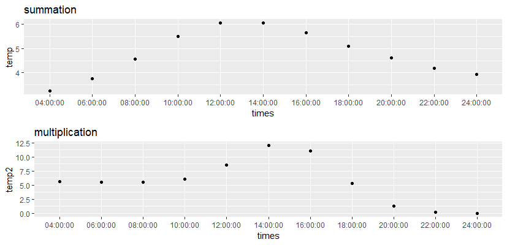

```{r setup, include=FALSE}
knitr::opts_chunk$set(echo = TRUE, warning = FALSE)
```

#Assignment 1

```{r eval=FALSE,echo=FALSE}
#1.1########################################################################
set.seed(1234567890)
library(geosphere)
Sys.setlocale(locale = "latin")
stations <- read.csv("stations.csv",stringsAsFactors = F,fileEncoding = "latin1")
temps <- read.csv("temps50k.csv",stringsAsFactors = F)
st <- merge(stations,temps,by="station_number")

times <- c("04:00:00", "06:00:00","08:00:00" ,"10:00:00","12:00:00","14:00:00", 
           "16:00:00","18:00:00","20:00:00","22:00:00","24:00:00")

temp <- vector(length=length(times))
temp2 <- vector(length=length(times))

### Students’ code here ########################################################

h_distance <- 33000
h_date <-40
h_time <-4   # control the smoothness of temperatures in a day
a <- 58.4137 
b <- 15.6235 
date1 <- "2013-7-23"
# date1 <- "2013-12-23"

required<-st[st$date< date1,]   # only consider the dates before date1
times1 <- as.POSIXct(times,format="%H:%M:%S")

##distances by geography
d1<-distm(required[,c("latitude","longitude")], c(a,b))
k1<-exp(-(d1/h_distance)^2)

##distances by dates
d2<-as.numeric(
  difftime(as.POSIXct(date1,format="%Y-%m-%d"),
           as.POSIXct(required$date,format="%Y-%m-%d"),
           units="days")
)
k2<-exp(-(d2/h_date)^2)

for(i in 1:length(times1)){
  ##distances by hours
  dist <- as.numeric(
    difftime(as.POSIXct(required$time,format="%H:%M:%S"),
             times1[i],
             units="hours")
  )
  k3<-exp(-(dist/h_time)^2)
  
  K<-as.vector(k1)+as.vector(k2)+as.vector(k3)
  temp[i]<-sum(K*required$air_temperature)/sum(K)
  K<-as.vector(k1)*as.vector(k2)*as.vector(k3)
  temp2[i]<-sum(K*required$air_temperature)/sum(K)
  
}

df <- data.frame(times=times, 
                 temp=temp,
                 temp2=temp2)

library(ggplot2)
p1<-ggplot(df,aes(x=times, y=temp))+geom_point()+labs(title="summation")
p2<-ggplot(df,aes(x=times, y=temp2))+geom_point()+labs(title="multiplication")
plot(gridExtra::arrangeGrob(p1,p2))
```

We implement a kernel method to predict the hourly temperatures for a date and place in Sweden. The *h* values are 33000, 40, 4 for distance, date and hour respectively. The following plots are the temperature predictions in Linkoping (58.4137,15.6235).

###2018-7-23

```{r echo = FALSE,out.height="215px"}

```

###2018-12-23

```{r echo = FALSE,out.height="215px"}

```

When the distances $d_i$ are smaller, the corresponding $k_i$ would be larger depending on exponentiating the negative values. Therefore, a larger weight will be added into our prediction model. This is reasonable happened in "summation" model (5+0.1+0.1=5.2). However, these impacts might be smaller in "multiplication" model since multiplication can smaller the final kernel values if enough large data are considered (5\*0.1\*0.1=0.05). This might be the reason why "multiplication" model can always show us a wider range prediction than "summation" model.


#Assignment 2

```{r eval=FALSE}
#2########################################################################
library(kernlab)
set.seed(1234567890)
data(spam)
data <- spam; rm(spam)
n=dim(data)[1]
id=sample(1:n, floor(n*0.4))
train=data[id,]
id1=setdiff(1:n, id)
id2=sample(id1, floor(n*0.3))
valid=data[id2,]
id3=setdiff(id1,id2)
test=data[id3,]
```

##2.1

```{r eval=FALSE}
#2.1#####################################################
mdl1 <- ksvm(type~.,data=train,
            kernel="rbfdot",kpar=list(sigma=0.05),
            C=0.5)
mdl2 <- ksvm(type~.,data=train,
             kernel="rbfdot",kpar=list(sigma=0.05),
             C=1)
mdl3 <- ksvm(type~.,data=train,
             kernel="rbfdot",kpar=list(sigma=0.05),
             C=5)

id <- which(colnames(data)=="type")
e1 <- mean(predict(mdl1,valid[,-id])!=valid[,id])  #0.08695652
e2 <- mean(predict(mdl2,valid[,-id])!=valid[,id])  #0.07826087
e3 <- mean(predict(mdl3,valid[,-id])!=valid[,id])  #0.07681159
```

We calculate the misclassification error rates of such three SVM model trained by training set, the model with $C=5$ has the smallest error rate.

##2.2

```{r eval=FALSE}
#2.3###########################################################################
ntrain <- rbind(train,valid)
mdl3 <- ksvm(type~.,data=ntrain,
             kernel="rbfdot",kpar=list(sigma=0.05),
             C=5)
e3 <- mean(predict(mdl3,test[,-id])!=test[,id])  #0.08182476
```

We create a new model with the same hyper-parameters of *mdl3* and then train by the training and validation sets. The misclassification error rate (generalization error) of such model for test set is 0.08182476.

##2.3

```{r eval=FALSE}
#2.4###########################################################################
mdl3

# Support Vector Machine object of class "ksvm" 
# 
# SV type: C-svc  (classification) 
#  parameter : cost C = 5 
# 
# Gaussian Radial Basis kernel function. 
#  Hyperparameter : sigma =  0.05 
# 
# Number of Support Vectors : 1102 
# 
# Objective Function Value : -1331.309 
# Training error : 0.018323 
```

##2.4

$C$ is the cost of constraints violation, which represents the tolerance level for misclassification. If *C* is too larg, the model is very strict and the model would thereby be overfitting with high variance. In contrast, if *C* is too small, the model would be easy to be underfitting with high bias.

\newpage
##Appendix


```{r, ref.label=knitr::all_labels(), echo=TRUE, eval=FALSE}

```